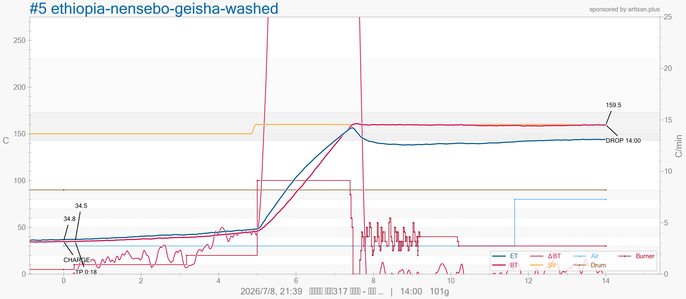

# Kaleido M1：SV、Burner、Air 空機測試與操作模型

這份文件整合 2026-07-05 與 2026-07-08 兩次空機測試，用來理解目前這台 Kaleido M1 Artisan 版的 SV、Burner、Air 如何共同影響 ET / BT。第二次測試的控制區間與資料較完整，因此作為主要證據；第一次測試保留為低 SV 行為的補充基準。

本文是本機實測建立的工作模型，沒有公開的 Kaleido 控制板演算法可供核對。規劃烘焙或覆盤曲線時，還要先讀 [Kaleido M1 機器報告：運作機制、熱能來源與曲線判讀基準](kaleido-m1-machine-and-heat-system.md)。報告中列為「待確認」的機器資訊不能自行補成已知事實。

## 先說結論

| 判讀 | 證據程度 | 目前可以怎麼用 |
| --- | --- | --- |
| 溫度遠低於 SV 時，Burner 會明顯改變升溫速度 | 較強 | SV 保留足夠溫差後，再用 Burner 安排升溫動能 |
| BT 接近 SV 時，實際 Burner 輸出會下降並反覆調節 | 較強 | SV 太接近當下 BT 時，持續拉高 Burner 也可能被控溫邏輯壓住 |
| SV 是容許小幅超調的控溫目標 | 較強 | SV 不能當成絕對硬上限；控制延遲仍可能讓 BT 短暫超過目標 |
| SV `0°C` 時只提高 Burner，機器幾乎不升溫 | 較強 | SV 不能留在無效或過低設定 |
| Air 在 SV 附近從 `30%` 提高到 `80%` 沒有造成大幅持續降溫 | 部分 | 只能說恆溫附近的探針反應不大，不能外推到有豆與持續升溫區間 |
| Air 對正式烘焙升溫速度與風味的影響 | 待確認 | 要用固定 SV、Burner、Drum、豆量與起始條件另外測試 |

目前最實用的工作模型是：

```text
溫度離 SV 很遠：Burner 大小主要影響升溫快慢。
溫度逐漸接近 SV：控制系統開始降低實際加熱輸出。
溫度到 SV 附近：實際 Burner 會調節，BT 留在目標附近。
Air 同時參與對流、排濕、排煙與排熱；目前還沒有完整的升溫期實測。
```

## 測試前提：兩次都沒有入豆

2026-07-05 與 2026-07-08 都是空機測試，全程沒有實際放入咖啡豆。

第二次測試按下 CHARGE，只是因為 Artisan 需要進入正式記錄流程。這個事件不能解讀成實際入豆。第二次 `.alog` 內的豆名與生豆重量 `101g` 是殘留資料；CHARGE、DROP 和相關烘焙欄位是記錄流程中的事件或衍生值。這些欄位不能拿來計算實際重量損失、階段比例、發展時間或杯測關係。

因此，本文只分析：

- SV、Burner、Air、Drum 的設定與回傳值。
- ET（Environment Temperature，環境溫度探針）與 BT（Bean Temperature，豆溫探針）的空機讀值。
- 各固定控制區間的升溫趨勢。
- 接近 SV 前後的實際 Burner 變化。

空機時 BT 仍只是 BT 通道的探針讀值，沒有豆堆可供測量，不能把它理解成咖啡豆溫度。

## 原始測試資料

### 第一次：2026-07-05 低 SV 基準測試

| 類型 | 檔案 |
| --- | --- |
| Artisan 原始檔 | [2026-07-05-sv-burner-air-empty-drum.alog](tests/2026-07-05-sv-burner-air-empty-drum/2026-07-05-sv-burner-air-empty-drum.alog) |
| Artisan CSV | [2026-07-05-sv-burner-air-empty-drum.csv](tests/2026-07-05-sv-burner-air-empty-drum/2026-07-05-sv-burner-air-empty-drum.csv) |
| Artisan 曲線圖 | [2026-07-05-sv-burner-air-empty-drum.png](tests/2026-07-05-sv-burner-air-empty-drum/2026-07-05-sv-burner-air-empty-drum.png) |

### 第二次：2026-07-08 控制區間測試

| 類型 | 檔案 |
| --- | --- |
| Artisan 原始檔 | [2026-07-08-sv-burner-air-empty-drum.alog](tests/2026-07-08-sv-burner-air-empty-drum/2026-07-08-sv-burner-air-empty-drum.alog) |
| Artisan CSV | [2026-07-08-sv-burner-air-empty-drum.csv](tests/2026-07-08-sv-burner-air-empty-drum/2026-07-08-sv-burner-air-empty-drum.csv) |
| Artisan 曲線圖 | [2026-07-08-sv-burner-air-empty-drum.png](tests/2026-07-08-sv-burner-air-empty-drum/2026-07-08-sv-burner-air-empty-drum.png) |



## 三個控制項先怎麼理解

| 名稱 | 白話解釋 | 兩次測試支持的理解 |
| --- | --- | --- |
| SV（Set Value，設定目標值） | 控制系統追逐的溫度目標 | SV 與當下量測溫度的差距會影響實際加熱輸出；接近目標時會出現調節 |
| Burner（加熱輸出） | 向電熱系統要求的輸出百分比 | 遠低於 SV 時會明顯改變升溫速度；接近 SV 時可能被控溫邏輯降低 |
| Air（風量） | 控制氣流、排濕、排煙與排熱 | 恆溫附近沒有看到大幅探針降溫；升溫期與有豆條件仍待測試 |

Artisan 沿用 `Burner` 這個名稱，M1 實際使用電熱管，機器內沒有瓦斯火焰。機器熱能來源與控制限制以機器基準文件為準。

## 第二次測試資料條件

| 項目 | 紀錄 |
| --- | --- |
| 測試日期 | `2026-07-08` |
| 測試物 | 空機，沒有放豆 |
| Artisan 版本 | `4.0.2` |
| 取樣間隔 | 約 `1.5` 秒 |
| 資料點 | `624` 筆 |
| CSV 記錄範圍 | `0:00-15:34` |
| CHARGE | `1:34`；只供 Artisan 記錄 |
| Drum | 開始後穩定在 `90%` |
| AT | 全程顯示 `29.2°C`；實體感測位置仍待確認 |

本文時間使用 CSV `Time1`，從開始記錄的 `0:00` 起算。曲線圖把 CHARGE 當作橫軸 `0:00`，所以圖上的時間會比本文少約 `1:34`。

CSV 控制欄位和 Artisan 裝置資料的對應如下：

| CSV 欄位 | 控制項 |
| --- | --- |
| `{3}` | Burner / Heater，加熱輸出 |
| `{0}` | Air / Fan，風量 |
| `SV` | Set Value，設定目標溫度 |
| `{1}` | Drum，滾筒轉速 |

## 分析方式

每一段只選 SV、Burner、Air、Drum 都保持固定的資料。ET 與 BT 的「升溫斜率」以該時段全部原始點做線性趨勢估算，單位是 `°C/min`。

這些斜率沒有套用 Artisan 的 RoR 平滑與濾波設定。它們只適合比較這次空機測試內的控制反應，不能直接當成正式烘焙的 RoR 目標。

## 第二次測試結果一：遠低於 SV 時，Burner 會改變升溫速度

SV `150°C`、Air `30%`、Drum `90%` 固定時：

| CSV 時間 | Burner | ET 變化 | ET 斜率 | BT 通道變化 | BT 通道斜率 |
| --- | ---: | ---: | ---: | ---: | ---: |
| `0:41-1:49` | `5%` | `35.9 -> 37.1°C` | `0.92°C/min` | `34.4 -> 34.9°C` | `0.52°C/min` |
| `1:54-4:42` | `10%` | `37.2 -> 42.0°C` | `2.00°C/min` | `34.8 -> 39.2°C` | `1.62°C/min` |
| `4:46-6:25` | `20%` | `42.3 -> 47.7°C` | `3.45°C/min` | `39.4 -> 45.1°C` | `3.68°C/min` |

Burner 提高後，兩支探針的升溫斜率都增加。這支持「溫度離 SV 很遠時，Burner 具有明顯控制力」。

三段的起始溫度、持續時間與機器蓄熱狀態不同，所以只能確認方向，不能建立 Burner 百分比與瓦數或升溫速度的固定換算公式。

## 第二次測試結果二：接近 SV 後，實際 Burner 會被調節

`6:25-6:30` 間，SV 從 `150°C` 提高到 `160°C`；`6:34` 起，Burner 穩定在 `100%`。當時 ET / BT 通道約為 `48°C / 46°C`，離 SV 很遠：

| CSV 時間 | SV | Burner | ET 變化 | BT 通道變化 |
| --- | ---: | ---: | ---: | ---: |
| `6:34-8:54` | `160°C` | `100%` | `48.4 -> 153.7°C` | `46.1 -> 154.7°C` |

接近 SV 後，實際輸出快速變化：

| 時間 | ET | BT 通道 | 實際 Burner | 觀察 |
| --- | ---: | ---: | ---: | --- |
| `8:55` | `154.5°C` | `155.8°C` | `95%` | 輸出首次低於 `100%` |
| `9:01` | `156.6°C` | `159.9°C` | `50%` | ET 到最高點，輸出已降一半 |
| `9:06` | `153.5°C` | `160.8°C` | `0%` | BT 通道小幅超過 SV，輸出降到 `0%` |
| `10:00-15:34` | 平均 `141.0°C` | 平均 `159.1°C` | 平均 `32.8%` | BT 通道長時間貼近 SV，ET 先降後緩升 |

`10:00-15:34` 的 BT 通道範圍是 `158.1-159.9°C`，標準差約 `0.41°C`；ET 範圍是 `138.0-144.2°C`。

這份資料顯示控制結果更貼近 BT 通道的 `160°C`。`.alog` 也記錄 `pidSource: 1`，但 `1` 的完整定義仍需要從 Artisan 設定畫面或 Kaleido 官方資料確認。現階段可以確認 SV 接近目標時會主動限制或調節實際輸出，控制來源的正式名稱仍標為待確認。

BT 通道最高到 `160.8°C`，表示 SV 容許控制延遲與小幅超調，不能視為絕對硬上限。

## 第二次測試結果三：Air `30% -> 80%` 沒有造成大幅持續降溫

Air 在 `13:15` 由 `30%` 提高到 `80%`。當時 SV `160°C`、Burner `30%`、Drum `90%`，BT 通道已經在 SV 附近。

比較 Air 改變前後各 `75` 秒、其餘控制值固定的區間：

| 區間 | Air | ET 變化 | ET 斜率 | BT 通道變化 | BT 通道斜率 |
| --- | ---: | ---: | ---: | ---: | ---: |
| `11:55-13:10` | `30%` | `139.6 -> 141.1°C` | `1.54°C/min` | `159.3 -> 158.9°C` | `-0.35°C/min` |
| `13:20-14:35` | `80%` | `142.0 -> 143.2°C` | `1.23°C/min` | `158.8 -> 158.8°C` | `0.37°C/min` |

Air 提高後，ET 上升斜率少了約 `0.31°C/min`，BT 通道則從微降轉為微升。兩支探針沒有呈現一致的大幅冷卻訊號。

原始值也顯示：

- `13:10`、Air `30%`：ET `141.1°C`、BT 通道 `158.9°C`
- `13:15`、Air `80%`：ET `141.6°C`、BT 通道 `159.0°C`
- `13:30`、Air `80%`：ET `142.2°C`、BT 通道 `158.5°C`
- `15:34`、Air `80%`：ET `144.0°C`、BT 通道 `159.5°C`

這只能支持「空機、SV 附近、Burner `30%` 的條件下，Air `30% -> 80%` 沒有造成大幅持續的探針降溫」。改 Air 時已經進入恆溫附近，沒有測到遠低於 SV 的持續升溫區間。

## 第一次測試補充：SV `0°C` 與低目標行為

2026-07-05 的第一次空機測試提供了第二次測試沒有涵蓋的低 SV 基準：

| 時間 | SV | Burner | Air | ET | BT 通道 | 觀察 |
| --- | ---: | ---: | ---: | ---: | ---: | --- |
| `0:00` | `0°C` | `5%` | `0%` | `30.6°C` | `30.3°C` | 起始接近室溫 |
| `1:00` | `0°C` | `100%` | `5%` | `31.6°C` | `31.2°C` | Burner 拉高，溫度仍幾乎不動 |
| `2:00` | `50°C` | `100%` | `5%` | `47.5°C` | `40.7°C` | SV 拉高後開始升溫 |
| `3:00` | `50°C` | `100%` | `5%` | `52.8°C` | `51.9°C` | 接近 SV 後停在 `50°C` 左右 |
| `3:30` | `50°C` | `100%` | `35%` | `49.6°C` | `51.3°C` | Air 提高後，BT 通道沒有大幅下降 |
| `5:30` | `50°C` | `40%` | `70%` | `46.7°C` | `49.8°C` | Burner 降低、Air 提高，BT 通道仍在 `50°C` 附近 |
| `7:00` | `50°C` | `10%` | `70%` | `47.1°C` | `49.9°C` | 低 Burner 已足以維持低 SV |

第一次測試支持兩項判斷：

1. SV `0°C` 會讓高 Burner 指令失去有效升溫空間。
2. 已接近低 SV 時，Burner `10%` 與高 Burner 都可能被控溫邏輯拉回相近的穩定溫度。

第二次測試補上另一半：溫度離 SV 很遠時，Burner `5%`、`10%`、`20%` 的升溫速度確實不同。兩次資料合起來後，Burner 的效果要同時看 SV 與目前探針溫度之間的差距。

## 已驗證、部分驗證與待確認

### 已有較強證據

1. SV 會影響實際加熱行為；SV `0°C` 時只提高 Burner 幾乎無法升溫。
2. 遠低於 SV 時，提高 Burner 會加快 ET / BT 通道升溫。
3. 接近 SV 時，實際 Burner 會降低並反覆調節。
4. SV 具有控制延遲與小幅超調；第二次測試的 BT 通道最高超過 SV 約 `0.8°C`。

### 只有部分證據

1. 空機恆溫附近提高 Air，沒有造成大幅持續的 ET / BT 通道下降。
2. 第二次測試看起來由 BT 通道貼近 SV，但實際 PID 來源名稱仍待確認。
3. 正式烘焙中若 SV 長時間停在接近 BT 的低目標，可能限制中後段熱量；還要搭配有豆曲線逐鍋驗證。

### 仍待確認

1. 固定 SV `150°C` 時，Burner `100%` 能否長時間突破 `150°C`。第二次測試在拉到 Burner `100%` 前，已把 SV 改成 `160°C`。
2. 遠低於 SV、持續升溫時，Air `30%` 與 `80%` 對斜率的實際差異。
3. 有豆後的吸熱、水分蒸發、煙與銀皮會如何改變 SV、Burner、Air 的關係。
4. AUTO / MANUAL 狀態、控制板韌體與 Artisan 設定對輸出調節的完整影響。

## 對正式烘焙計畫的影響

兩次空機測試支持以下規劃原則：

1. 預熱要記錄 SV、Burner、Air、Drum 與穩定時間，不能只寫一個入豆溫度。
2. 實際入豆後要讓 SV 保留足夠的升溫空間，避免 BT 接近低 SV 時過早進入輸出調節。
3. 曲線主要動能仍由 Burner 安排，但每次判讀都要同時看 SV 與當下溫差。
4. Air 先用少量、固定段落調整，並記錄改動後一段時間的 ET、BT、RoR、排煙與氣味。
5. 空機斜率不能直接當成有豆 RoR，也不能由 Burner 百分比直接換算加熱瓦數。

過去第三、四鍋在入豆後讓 SV 長時間停在 `150°C`，曲線接近該區間時出現失速。空機測試提供了一個合理機制：SV 接近量測溫度後，實際輸出可能被調節。這仍是工作假設，覆盤要同時檢查 Burner、Air、豆量、預熱熱庫存與量測延遲。

先前參考曲線在 CHARGE 後把 SV 提高到約 `220°C`，可理解成為後續升溫保留控制空間。測試只證明「需要足夠溫差」，沒有證明 `220-230°C` 適合所有豆子、豆量與目標。每一鍋仍要依機器基準文件、生豆條件與烘焙目標另做計畫，SV 不得超過本機安全上限 `230°C`。

## 覆盤時怎麼用這份資料

看到 RoR 失速或 BT 接近平台時，依序檢查：

1. 當時 SV 和 BT 的差距還剩多少。
2. Artisan 記錄的實際 Burner 是否已開始下降或反覆調節。
3. 同一時間有沒有降低 Burner、提高 Air 或改 Drum。
4. 操作後 ET、BT 與 RoR 經過多久才反應。
5. 豆量、探針接觸、預熱時間與前一鍋蓄熱是否一致。

先把事件與數值列出，再寫可能原因。空機測試只能提供機器控制的候選解釋，不能單獨證明正式烘焙失敗的原因。

## 下一輪測試

### 測試 A：固定 SV，比較 Burner

目的：確認 SV `150°C` 對高 Burner 的限制程度。

1. 全程空機，記錄測試前冷卻時間與起始 ET / BT 通道溫度。
2. SV 固定 `150°C`，Air 固定 `30%`，Drum 固定 `90%`。
3. Burner `20%` 與 `100%` 分開做獨立測試。
4. 比較相同溫度區間的升溫時間、穩定平台、最高超調與實際 Burner 回傳值。
5. 每個條件至少重複兩次。

### 測試 B：持續升溫時比較 Air

目的：確認遠低於 SV 時，提高 Air 是否改變 ET / BT 通道斜率。

1. 全程空機，SV 固定 `200°C`，Burner 與 Drum 固定。
2. Air `30%` 與 `80%` 分開做獨立測試。
3. 使用相同起始溫度，並交換測試順序。
4. 比較相同溫度區間的升溫時間與線性斜率。
5. 每個條件至少重複兩次。

按 CHARGE 只為了 Artisan 記錄時，要在測試筆記與檔案索引明確註明「沒有入豆」，避免後續把事件標記誤認成正式烘焙。

## 安全提醒

- 空機測試仍有高溫、熱風與電熱管起火風險，全程留在機器旁。
- 保持通風，確認排氣路徑暢通，附近不要放易燃物。
- 加熱時維持滾筒轉動。
- SV 不得超過本機安全上限 `230°C`。
- 測試完成後依機器基準文件執行降溫，降到安全溫度再關機。
- 每次測試保留 `.alog`、`.csv`、`.png` 與操作筆記，不能只留結論。
